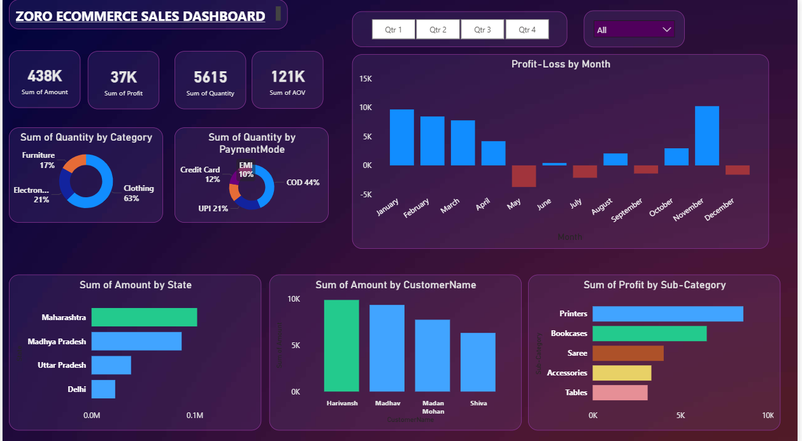

# -Zoro-Ecommerce-Sales-Dashboard-SQL-Server-Power-BI

This project demonstrates how raw ecommerce sales and order data can be transformed into business insights using SQL Server for data management and Power BI for visualization.  The pipeline integrates CSV datasets into SQL Server, builds relationships across orders and sales details, and visualizes results in an interactive Power BI dashboard.

=>Repository Contents

1-DETAILS.csv → Sales details dataset (product category, amount, quantity, profit).
2-Orders.csv → Orders dataset (customer, region, state, payment mode, date).
3-Dashboard.png → Power BI dashboard screenshot for quick preview.
4-Dashboard.pdf → Full exported Power BI dashboard report.

=>Tech Stack

1-SQL Server → Data ingestion, cleaning, schema creation, and joins.
2-Power BI → Data modeling and dashboard visualization.
3-CSV Files → Raw ecommerce datasets.
4-DAX & SQL → Used for calculations and metrics.

=>Workflow

1-Import DETAILS.csv and Orders.csv into SQL Server.
2-Handle datatype mismatches, create staging tables, and build relationships.
3-Connect SQL Server to Power BI Desktop.
4-Model data across Orders ↔ Details for analysis.
5-Build dashboards highlighting sales trends, profits, categories, and customer insights.
6-Export dashboard (Dashboard.pdf) and preview (Dashboard.png).

=>Key Insights

->Overall Sales Performance: ₹438K total sales, 37K total profit, 5615 units sold, ₹121K AOV.
->Category Insights: Clothing contributes the largest share (63%), followed by Electronics (21%) and Furniture (17%).
->Payment Modes: COD dominates with 44% share, followed by UPI (21%), Debit (13%), Credit (12%), and EMI (10%).
->Geographic Trends: Maharashtra and Madhya Pradesh are top contributing states.
->Customer Analysis: Certain high-value customers drive significant revenue.
->Monthly Profit-Loss: Strong revenue early in the year, dips in May & June before recovery later.

=>

Conclusion

=>This project demonstrates a complete data pipeline from raw CSVs to SQL Server to Power BI dashboards. It provides actionable insights into sales, profits, product categories, customer behavior, and payment modes.
It serves as a reference for data analytics, ETL workflows, and business intelligence reporting.
